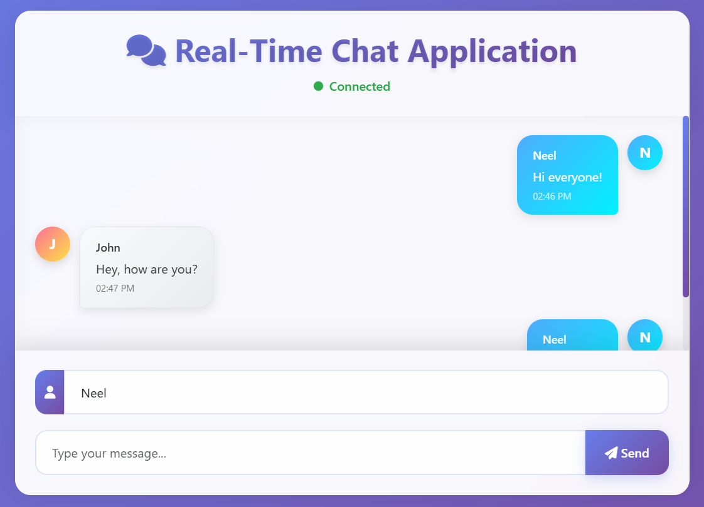
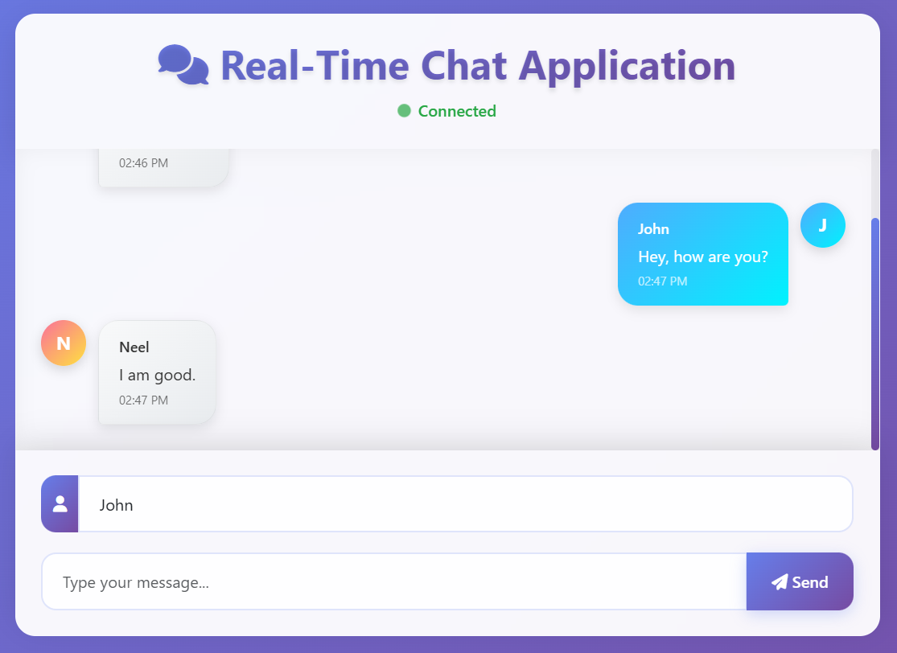

# 🗨️ Real-Time Chat Application

## 📌 Project Overview

The **Real-Time Chat Application** is a web-based communication platform that enables multiple users to chat with each other in real time. It demonstrates the integration of modern front-end and back-end technologies to deliver low-latency, bi-directional communication using WebSockets.

Users can simply enter their name and start chatting, with all messages broadcast instantly to connected clients without page reloads.

<p align="center">
  
  
</p>

---

## ⚙️ How It Works

### ✅ Real-Time Communication

This application uses **WebSockets** to maintain a persistent, full-duplex connection between the server and clients. To manage message flow and subscriptions, the app implements the **STOMP (Simple Text Oriented Messaging Protocol)** on top of WebSockets.

Messages are routed through a Spring-based message broker and broadcast to all subscribed clients, enabling seamless real-time interaction.

---

## 🧱 Technology Stack

### 🔧 Backend (Server-Side)
- **Spring Boot** – Main application framework for REST endpoints and message broker configuration
- **Spring WebSocket** – Enables WebSocket-based communication
- **Spring Messaging (STOMP Protocol)** – Used for real-time messaging via STOMP
- **Thymeleaf** – Server-side rendering of dynamic HTML

### 🎨 Frontend (Client-Side)
- **Thymeleaf** – Template engine for building HTML views
- **JavaScript (ES6)** – Handles DOM manipulation and WebSocket interaction
- **SockJS** – WebSocket fallback for broader browser compatibility
- **STOMP.js** – Client-side messaging over WebSockets using STOMP
- **HTML/CSS** – Markup and styling
- **Bootstrap** – Responsive UI design and components

---

## 🔨 Development and Infrastructure Tools
- **Maven/Gradle** – Build automation and dependency management

---

## 💬 Features
- Real-time two-way communication using WebSocket
- Broadcast messages to all connected users
- Color-coded avatars and user initials
- Responsive and clean UI
- Online status indicator ("Connected")
- Automatic scroll to latest message

---

## 📂 How to Run

> 🛠️ *Add your build/run instructions here, e.g., Maven commands or how to launch the Spring Boot app locally.*

```bash
# Clone the repository
git clone https://github.com/yourusername/realtime-chat-app.git

# Navigate to the project directory
cd realtime-chat-app

# Run the Spring Boot app
./mvnw spring-boot:run
